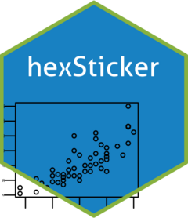

<!-- README.md is generated from README.Rmd. Please edit that file -->

```{r, include = FALSE}
knitr::opts_chunk$set(
  collapse = TRUE,
  comment = "#>",
  fig.path = "man/figures/README-",
  out.width = "100%"
)
```

# statbanker 

<a href="https://xprimexinverse.github.io/statbanker/"></a>

<!-- badges: start -->
<!-- badges: end -->

UNDER CONSTRUCTION - Come back later... =D

The goal of statbanker is to download data from the CSO's PxStat Open Data Database.

## Installation

You can install the development version of statbanker from [GitHub](https://github.com/) with:

``` r
# install.packages("pak")
pak::pak("xprimexinverse/statbanker")
```

## Example

This is a basic example which shows you how to solve a common problem:

```{r example}
library(statbanker)
NAQ01 <- getStatBankData("NAQ01", type = "px")
NAQ01_TS <- px2ts(NAQ01) 
plot.ts(NAQ01_TS[,2])
```
