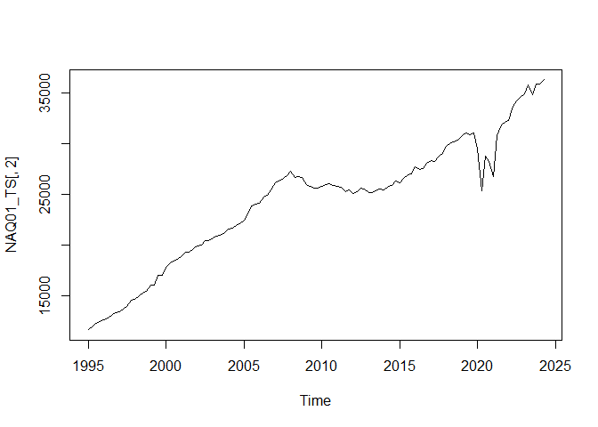

<!-- README.md is generated from README.Rmd. Please edit that file -->

# statbanker

<a href="https://xprimexinverse.github.io/statbanker/"></a>

<!-- badges: start -->
<!-- badges: end -->

UNDER CONSTRUCTION - Come back later… =D

The goal of statbanker is to download data from the CSO’s PxStat Open
Data Database.

## Installation

You can install the development version of statbanker from
[GitHub](https://github.com/) with:

``` r
# install.packages("pak")
pak::pak("xprimexinverse/statbanker")
```

## Example

This is a basic example which shows you how to solve a common problem:

``` r
library(statbanker)
NAQ01 <- getStatBankData("NAQ01", type = "px")
#> *** METADATA ***
#> CSO Table =  NAQ01 
#> TITLE =  Expenditure on GNP and Percentage change on Expenditure on GNP at Constant Market Prices - Sectors and Quarter 1995Q1 - 2024Q2 
#> UNITS =  Euro Million 
#> SOURCE =  Central Statistics Office, Ireland 
#> DATABASE =  
#> CREATION DATE =  
#> LAST UPDATED =  20240905 11:00 
#> FILE ADDRESS =  https://ws.cso.ie/public/api.restful/PxStat.Data.Cube_API.ReadDataset/NAQ01/PX/2013/
NAQ01_TS <- px2ts(NAQ01) 
#> The following `from` values were not present in `x`: dat
plot.ts(NAQ01_TS[,2])
```


